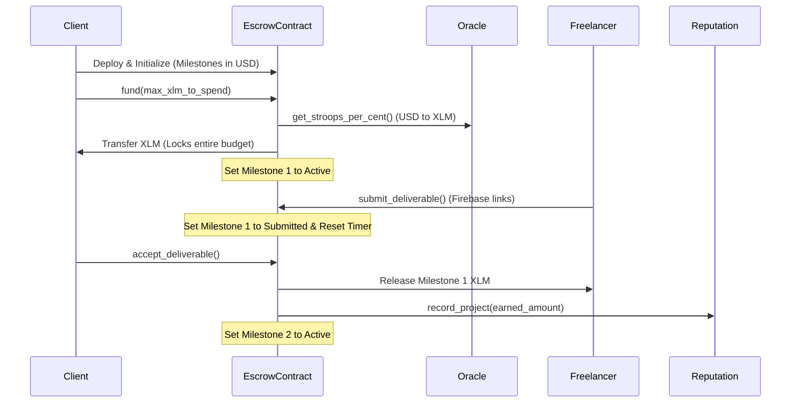

# LikhaSpace Workflows & Core Logic

This document provides a comprehensive technical breakdown of the 8 core features of LikhaSpace, explaining the underlying code, database schemas, smart contract functions, and game-theoretic designs.

---

## 1. Login & Wallet Verification

LikhaSpace uses a password-free, Web3-native login system backed by Stellar's **SEP-10 Web Authentication standard** and **Stellar Horizon** live on-chain stats check.

### SEP-10 Web Authentication Flow
The authentication pipeline spans [auth.ts](file:///c:/Users/venre/Documents/stellarp2/web/src/lib/auth.ts) and server-side API endpoints:
1. **Challenge Retrieval:** The frontend calls `/api/auth/sep10/challenge?address=<address>` to fetch a cryptographically secure challenge transaction generated by the server.
2. **User Signature:** The client signs the challenge transaction XDR via the Freighter wallet using the `StellarWalletsKit.signTransaction()` helper.
3. **Verification & Firebase Auth:** The signed XDR is sent to `/api/auth/sep10/verify` via a POST request. The server verifies the signature against the client's public key. Upon successful verification, it generates a custom Firebase Authentication token.
4. **Session Lock:** The frontend calls `signInWithCustomToken(auth, token)` to sign the user into Firebase.

### On-Chain Wallet Verification Rules
Before allowing users to book projects or publish listings, the system checks their wallet quality in [stellarVerification.ts](file:///c:/Users/venre/Documents/stellarp2/web/src/lib/stellarVerification.ts) to prevent Sybil attacks:
- **Horizon Account Fetch:** Queries the Stellar Horizon server (`loadAccount(address)`) to verify the account is active. If the account returns a `404`, it is considered completely unfunded (0 XLM balance).
- **Balance Requirement:** Verifies that the native XLM balance is $\ge 1\text{ XLM}$ to cover the basic on-chain reserves and network gas.
- **Account Age & Transactions:** Queries the oldest transaction (`transactions().forAccount(address).order('asc').limit(1)`) to compute the account age in days, and retrieves transaction history to verify that the wallet represents a genuine user.

---

## 2. Creating a Gig as a Freelancer

Freelancers can showcase their services by creating gigs with custom, milestone-based pricing.

- **Data Flow:** The gig details are filled in the frontend and saved off-chain in Firebase Firestore under the `gigs` collection (configured in [db.ts](file:///c:/Users/venre/Documents/stellarp2/web/src/lib/db.ts)).
- **Milestone Configuration:** In the `createGig` form, freelancers specify a list of deliverables and custom milestone payments. Each milestone has:
  - `title`: Name of the phase (e.g., "Wireframes", "Vector Asset Delivery").
  - `payoutUSD`: Budget allocation in USD.
  - `maxRevisions`: The number of free revisions included.
- **Off-chain State:** Gigs default to `active` (visible to clients) but can be set to `occupied` or `paused`.

---

## 3. Booking a Gig as a Client

Clients browse the marketplace and book freelancers directly.

- **Order Creation:** Booking a gig calls `createOrder` in [db.ts](file:///c:/Users/venre/Documents/stellarp2/web/src/lib/db.ts), writing an order document to the `orders` collection with status `pending_acceptance`.
- **Freelancer Review:** The freelancer receives a notification and reviews the order on their dashboard. They can:
  - **Accept:** Moves the order status to `awaiting_funding`.
  - **Deny:** Prompts the freelancer for a denial message, moving the order status to `denied`.
- **Funding Trigger:** Once accepted, the client is prompted to fund the project escrow on-chain.

---

## 4. Escrow & Milestone Deliverables System

LikhaSpace implements a **sequential milestone escrow model** governed by the [likha-escrow](file:///c:/Users/venre/Documents/stellarp2/contracts/likha-escrow/src/lib.rs) smart contract.

### On-Chain Deployment & Initialization
When funding begins, the client's browser deploys a dedicated smart contract instance for the project booking in [contractEscrow.ts](file:///c:/Users/venre/Documents/stellarp2/web/src/lib/contractEscrow.ts):
1. **Dynamic Contract Deployment:** Deploys a new `likha-escrow` contract using `Operation.createCustomContract()` and a unique 32-byte salt to prevent address collisions.
2. **Initialization:** Calls `initialize()` on the contract, locking in:
  - Freelancer and Client public addresses.
  - Native XLM SAC token address.
  - Mediator and Platform Treasury addresses.
  - Reputation contract ID.
  - A vector of `Milestone` structs (USD payout amounts and max revisions).
  - Paid revision prices.

### Oracle Pricing & Budget Locking
- **The `fund` method:** The client calls `fund(client, max_xlm_to_spend)`.
- **Conversion Rate Logic:** The contract queries the Reflector Mock Oracle (`lastprice` method for the token) to retrieve the exchange rate (XLM stroops per 1 USD cent).
- **Total Budget Lock:** It calculates the total XLM needed for all milestones. If the required XLM exceeds `max_xlm_to_spend`, it aborts (slippage protection). Otherwise, the contract pulls the total XLM from the client's wallet and locks it.
- **First Milestone Activation:** Milestone 1 changes from `Locked` to `Active`.

### Deliverable Submission, Review, and Revisions
- **Submission:** The freelancer uploads assets to Firebase Storage and calls `submit_deliverable()` in [contractEscrow.ts](file:///c:/Users/venre/Documents/stellarp2/web/src/lib/contractEscrow.ts). This sets the active milestone status to `Submitted` and resets the 14-day client timeout.
- **Acceptance:** The client reviews the work and calls `accept_deliverable()`. The contract transfers the milestone's allocated XLM directly to the freelancer, triggers the `likha-reputation` contract to update the freelancer's completed project counts, and activates the next milestone. If it was the last milestone, the escrow status changes to `Completed`.
- **Denial / Revisions:** If the client wants changes, they call `deny_deliverable()`. This increments `revisions_used` on-chain and moves the milestone state back to `Active`.
- **Paid Revisions:** If the client exceeds the freelancer's free revision count (`revisions_used >= max_revisions`), they must call `pay_for_revision()`. This pulls the configured paid revision XLM price directly from the client's wallet, transfers it immediately to the freelancer, and increments `max_revisions` by 1.

---

## 5. Cancellation System & Edge Cases

The escrow contract enforces specific rules to handle project cancellations, protect against unresponsive participants, and compensate freelancers for work done.

### Cancellation Scenarios
1. **Freelancer Backs Out:** The freelancer can cancel at any time by calling `freelancer_cancel()` or `refund_remaining()`. This instantly refunds all remaining locked XLM in the contract back to the client.
2. **Client Cancellation (Kill Fee):** The client can cancel the project by calling `client_cancel_with_kill_fee()`. To compensate the freelancer for the work started on the current phase:
   - The contract calculates a **75% kill fee** of the *active milestone's payout amount*.
   - This 75% fee is sent immediately to the freelancer.
   - The remaining locked balance is refunded to the client, and the escrow is marked `Cancelled`.
3. **Unfunded Project Cancellation:** Either party can cancel a project that has been booked but not yet funded by calling `cancel_unfunded()`.

### Timeouts & Unresponsiveness
- **Client Unresponsiveness Timeout (14 Days):** If the freelancer submits a deliverable and the client does not approve or request revisions within 14 days (`CLIENT_TIMEOUT = 1_209_600` seconds), the freelancer can call `claim_timeout()`. This releases the milestone payout to the freelancer as if it was approved and activates the next milestone.
- **Freelancer Inactivity Timeout (30 Days):** If the project is funded but the freelancer fails to submit a deliverable for 30 days (`FREELANCER_TIMEOUT = 2_592_000` seconds) after funding or after a revision request, the client can call `claim_refund_timeout()`. This returns all locked funds to the client and cancels the project.

---

## 6. Mediation System & Game-Theoretic Disputes

If a dispute arises that cannot be resolved through revisions, LikhaSpace transitions into dispute resolution, leveraging game-theoretic mechanics to encourage fair behavior.

### Mediation Entry
Either party can call `request_mediation()` in [contractDisputes.ts](file:///c:/Users/venre/Documents/stellarp2/web/src/lib/contractDisputes.ts) to lock the escrow into a `Disputed` state.
- **Rule:** This can only be triggered if the freelancer has submitted at least one deliverable (`has_submitted_once` is true) to prevent clients from locking contracts when no work has been done.

### Game Theory Split Proposal (Consensus path)
To avoid high mediator overhead, the system encourages peer-to-peer settlement via a split proposal mechanism:
- **Proposal:** Either party calls `propose_dispute_split(proposer, freelancer_payout, client_refund)`. The split must distribute *exactly* the remaining locked balance.
- **Consensus Option 1 (Accept):** The other party accepts the split by calling `accept_dispute_split()`. The funds are distributed as proposed, and the contract is cancelled.
- **Consensus Option 2 (Reject / Mutual Destruction):** The other party rejects the proposed split by calling `reject_dispute_split()`. **All locked funds are instantly sent to the platform treasury (`PLATFORM_TREASURY`) as a penalty.**
  - *Game Theory Rationale:* Because rejecting the proposal burns/forfeits the funds to the treasury, both parties are heavily incentivized to propose fair splits and accept reasonable compromises rather than acting out of malice or stubbornness.
- **Dispute Timeout (7 Days):** If one party proposes a split and the other party remains unresponsive for 7 days (604,800 seconds), the proposer can call `claim_dispute_timeout()`. This bypasses voting and forces a **50-50 split** of the locked funds.

### Mediator Intervention Escalation
If peer-to-peer negotiations break down, either party can call `escalate_to_mediator()`, which clears all active split proposals and moves the escrow status to `Mediation`.
- **Dashboard:** Designated mediators log in to the dedicated Mediator Dashboard (configured in [ActiveDisputesView.tsx](file:///c:/Users/venre/Documents/stellarp2/web/src/app/dashboard/mediator/ActiveDisputesView.tsx)). They can inspect the gig details, review the submitted files, read chat histories, and communicate with both parties.
- **On-Chain Resolution:** The mediator calls `resolve_dispute(mediator, freelancer_payout, client_refund)` from the dashboard, executing the final payout distribution on-chain.

---

## 7. User Profile Management

User profiles are stored off-chain in Firestore for speed and ease of discovery, but key metrics are verified by on-chain records.

- **Firestore Records:** User profiles are stored in the `users` collection (queried via `getUserProfile` in [db.ts](file:///c:/Users/venre/Documents/stellarp2/web/src/lib/db.ts)). It holds basic metadata (name, title, bio, email, portfolio, and social links).
- **Freelancer Stats Sync:** To prevent freelancers from fabricating their stats, the profile displays real-time data fetched from the `likha-reputation` smart contract on-chain:
  - Total completed projects (incremented on-chain by the escrow contract).
  - Total XLM earned (aggregated on-chain).
  - List of client reviews and ratings.

---

## 8. On-Chain Review System

LikhaSpace enforces accountability and trust using the [likha-reputation](file:///c:/Users/venre/Documents/stellarp2/contracts/likha-reputation/src/lib.rs) smart contract.

- **Triggering Reviews:** When a project reaches `Completed` state (the final milestone is approved) or is resolved via `Mediation`, the client can write a review.
- **Recording the Review:** The client signs a transaction that calls `add_review(client, freelancer, rating, text)` in [contractReputation.ts](file:///c:/Users/venre/Documents/stellarp2/web/src/lib/contractReputation.ts).
- **Reputation Ledger Update:** The reputation contract:
  1. Validates that the rating is between 1 and 5.
  2. Updates the freelancer's rating sum and rating count.
  3. Appends a `Review` struct containing the client's address, rating, review text, and ledger timestamp to the freelancer's persistent on-chain record.
- **Public Querying:** The frontend queries `getFreelancerReputation` directly from the smart contract to render the reviews list and average rating on the freelancer's public profile page.
